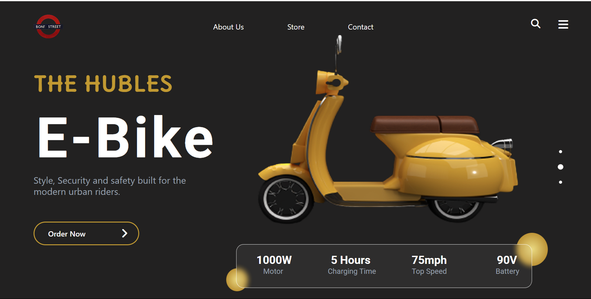
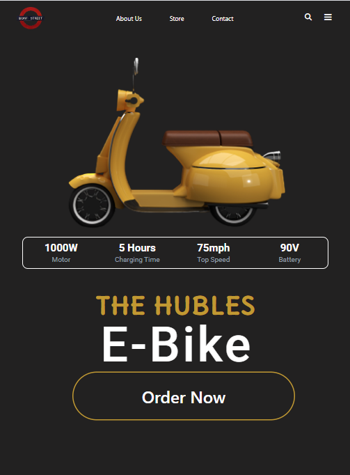

# Riot Games
Este é um site desenvolvido para a Situação de Aprendizem somativa, que exigia o uso do framework Tailwind, e responsividade para Desktop, Tablet e Mobile.

## DESKTOP

## TABLET

## MOBILE

## Tecnologias utilizadas
 * HTML
 * Tailwind
 * Responsividade
 * GITHUB
 * [FIGMA](<https://www.figma.com/design/Q77QzZNMl952Rp60UOtsKL/Lima-Atividade-e-bike--Copy-?node-id=0-1&p=f&t=J83wLRpXqvzLpz8N-0>)

  ## Como rodar localmente?
 Apos o Visual Studio Code Instalado, você ira selecionar abrir ou criar uma pasta, instale a extensão Live Server, na aba do projeto clique no Go Live localizado no canto inferior direito.

  ## Autor
* VINICIUS JULIO